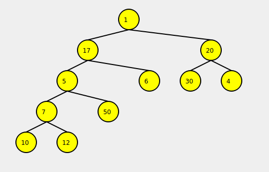
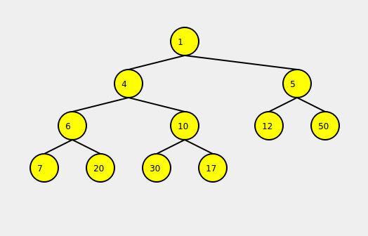

# System Programming 2 Course Assignment 4
### For Computer Science B.Sc. Ariel University

**By Shlomi Zecharia**

## Description

This project is part of the System Programming 2 course assignment at Ariel University. The goal is to implement a k-ary tree data structure with various traversal methods and provide a GUI to visualize the tree. The project includes functionality for complex number operations and uses unit tests to ensure correctness.




### Files Included

* **Tree.hpp**: 
  - This header file defines the `Tree` class template, which represents a k-ary tree. It includes methods for adding a root node, adding sub-nodes, and various tree traversal iterators (pre-order, post-order, in-order, BFS, DFS, and heap).

* **Node.hpp**: 
  - This header file defines the `Node` class template, which represents a node in the k-ary tree. It includes methods for managing child nodes, accessing parent nodes, and retrieving node values.

* **Complex.cpp**: 
  - This source file implements the methods for the `Complex` class, which provides operations for complex numbers, including arithmetic operations, comparison operators, and stream output.

* **Complex.hpp**: 
  - This header file defines the `Complex` class for representing complex numbers. It includes declarations for various operators and methods to perform arithmetic and comparison operations.

* **TreeWidget.cpp**: 
  - This source file implements the `TreeWidget` class, which is responsible for drawing the tree in a GUI using Qt. It includes methods for rendering the tree nodes and edges, as well as handling the painting events.

* **TreeWidget.hpp**: 
  - This header file defines the `TreeWidget` class, which inherits from `QWidget` and is used to visualize the k-ary tree in the GUI.

* **mainwindow.cpp**: 
  - This source file implements the main window of the GUI application. It sets up the UI and connects the tree widget for visualization.

* **mainwindow.hpp**: 
  - This header file defines the `MainWindow` class, which manages the main GUI window and includes the necessary UI components.

* **Test.cpp**: 
  - This source file contains the unit tests for the `Tree` and `Node` classes, as well as the `Complex` class. It uses the `doctest` framework to ensure that all functionalities are working correctly.

## Explanation

This project implements a k-ary tree data structure, where each node can have up to `k` children. The tree supports various traversal methods, such as pre-order, post-order, in-order, BFS, DFS, and heap traversal. The project also includes a GUI component using Qt to visualize the tree structure.

The `Complex` class provides functionality for complex number operations, which are used in various parts of the project.

Unit tests are included to verify the correctness of the tree operations and complex number operations.

## Requirements

* Linux machine (Ubuntu 22.04.1 LTS preferable)
* GNU cpp (g++ Compiler)
* Make
* Qt5

## Building

```bash
# Cloning the repo to local machine.
git clone https://github.com/2shlomi9/K-Ary-Tree-With-GUI.git

# Install g++ compiler 
sudo apt-get install g++

# Install qmake
sudo apt install qt5-qmake

# Building all the necessary files:
## Build Demo & Test:
cd Sources
make tree
make test

## Build GUI:
cd Project_GUI
qmake
make
